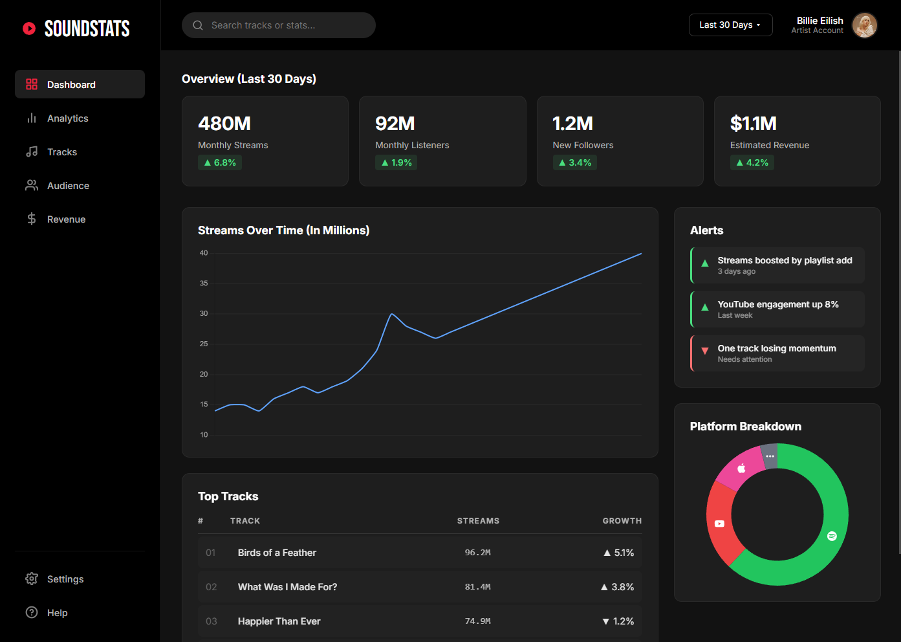

# SoundStats

  

SoundStats is a concept artist analytics dashboard built to explore layout, hierarchy, and data-driven UI design.

## About

The focus of this project was to create a realistic admin-style interface that prioritizes clarity and readability over visual spectacle. Instead of maximizing flair, the design leans toward restraint, structure, and usability.

## What it Shows

The dashboard presents mock performance data for an artist over a 30-day period, including:

- Streams, listeners, followers, and estimated revenue
- Stream trends over time
- Platform-wise audience distribution
- Top performing tracks
- Alerts that highlight notable changes and patterns

The intent is to surface meaningful signals rather than overwhelm the user with raw metrics.

## Implementation

Built using:

- HTML
- CSS (Grid and Flexbox)
- JavaScript
- Chart.js

Most of the effort went into layout decisions, spacing, chart behavior, and reducing unnecessary visual noise rather than adding features for the sake of complexity.

## Notes

All data shown is mock data and used purely for demonstration purposes.  
This project is not affiliated with any artist or music platform.

Feature complete. Any future work would focus on real data integration and deeper insights, not additional UI polish.
